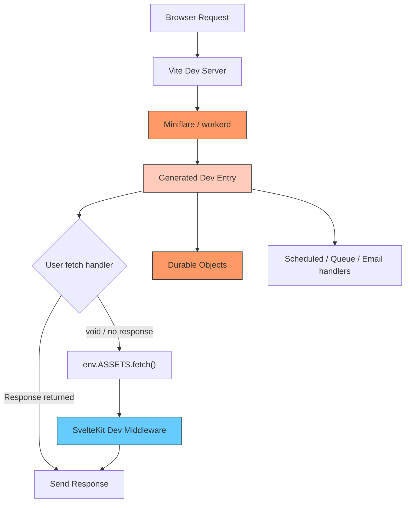
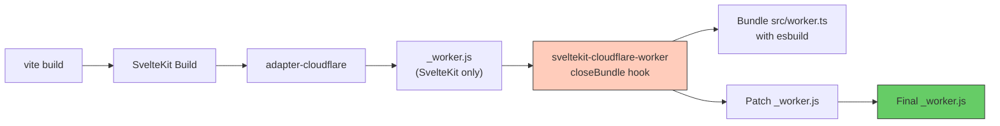
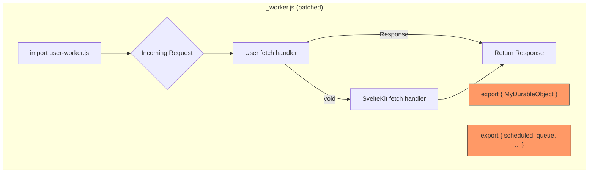
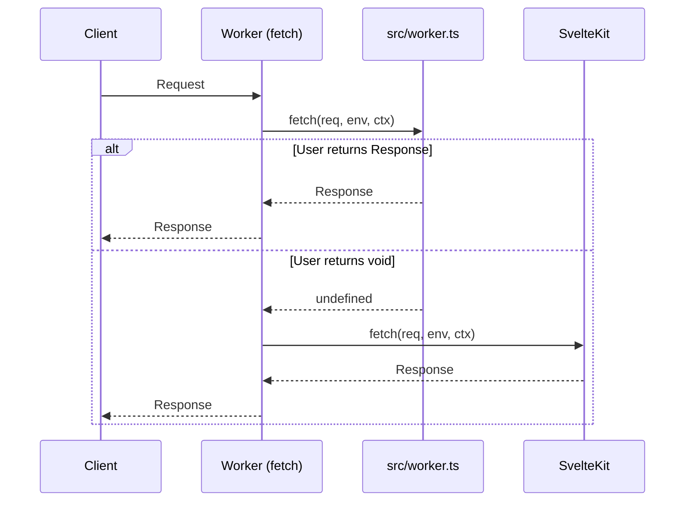
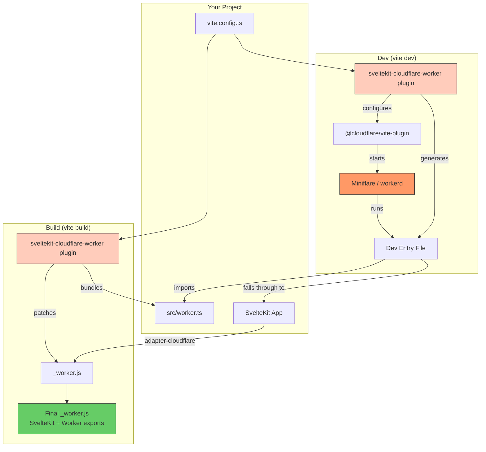

# sveltekit-cloudflare-worker

A Vite plugin that unlocks the full Cloudflare Workers platform from a SvelteKit app.

## The Problem

`@sveltejs/adapter-cloudflare` compiles your SvelteKit app into a single Cloudflare Worker with one export: a `fetch` handler that serves your pages and API routes. That's it. You can't:

- Export **Durable Objects** or **Workflows**
- Define **scheduled** (cron), **queue**, **email**, or **tail** handlers
- Intercept requests **before** SvelteKit's router (e.g. for lightweight API routes that skip SvelteKit overhead)

If you need any of these, you're stuck writing a separate Worker or maintaining a fork of the adapter.

## The Solution

This plugin lets you write a single `src/worker.ts` file that coexists with your SvelteKit app. You export whatever you need, and the plugin wires everything up, both at build time and in development.

```ts
// src/worker.ts
import type { WorkerFetch, WorkerScheduled } from 'sveltekit-cloudflare-worker';
import { DurableObject } from 'cloudflare:workers';

interface Env {
	MY_DO: DurableObjectNamespace<MyDurableObject>;
	ASSETS: Fetcher;
}

// Intercept requests before SvelteKit. Return nothing to fall through.
export const fetch: WorkerFetch<Env> = async (req, env, ctx) => {
	const url = new URL(req.url);

	if (url.pathname === '/api/do') {
		const stub = env.MY_DO.get(env.MY_DO.idFromName('test'));
		const message = await stub.sayHello();
		return Response.json({ message });
	}

	if (url.pathname.startsWith('/api/')) {
		return new Response('custom API response');
	}

	// Return nothing → SvelteKit handles the request
};

export const scheduled: WorkerScheduled = async (controller, env, ctx) => {
	console.log('cron triggered:', controller.cron);
};

export class MyDurableObject extends DurableObject {
	async sayHello(): string {
		return 'Hello from Durable Object!';
	}
}
```

## How It Works

The plugin operates in two distinct modes depending on whether you're running `vite dev` or `vite build`.

### Dev Mode

In development, the plugin wraps `@cloudflare/vite-plugin` to run your worker code inside a real `workerd` runtime via Miniflare. This means Durable Objects, bindings, and all Workers APIs work locally.



The plugin generates a dev entry file that:

1. **Re-exports** all classes (Durable Objects, Workflows) from `src/worker.ts`
2. **Wraps `fetch`** to call your handler first, then falls through to `env.ASSETS.fetch(request)` which routes back to SvelteKit
3. **Re-exports** other handlers (`scheduled`, `queue`, etc.) directly

The `@cloudflare/vite-plugin` handles the heavy lifting: starting Miniflare, running the Vite module runner inside workerd, hot-reloading on changes, and providing real bindings (KV, D1, R2, DO namespaces).

### Build Mode

At build time, the plugin runs **after** `@sveltejs/adapter-cloudflare` and patches the generated `_worker.js` to include your worker code.



The patched `_worker.js` ends up looking like this:



### Fetch Middleware Pattern

The `fetch` handler acts as middleware. Your handler runs first. If it returns a `Response`, that's what the client gets. If it returns `void` (or `undefined`), the request falls through to SvelteKit's router.



## Setup

### Install

```bash
npm install sveltekit-cloudflare-worker
npm install -D @cloudflare/vite-plugin
```

### Configure Vite

```ts
// vite.config.ts
import { sveltekit } from '@sveltejs/kit/vite';
import { cloudflareWorker } from 'sveltekit-cloudflare-worker';
import { defineConfig } from 'vite';

export default defineConfig({
	plugins: [sveltekit(), cloudflareWorker()]
});
```

### Create your worker file

```ts
// src/worker.ts
import type { WorkerFetch } from 'sveltekit-cloudflare-worker';

export const fetch: WorkerFetch = async (req, env, ctx) => {
	if (new URL(req.url).pathname.startsWith('/api/')) {
		return new Response('handled by worker');
	}
	// Falls through to SvelteKit
};
```

### Configure Wrangler

Your `wrangler.jsonc` stays standard. Add bindings for any DOs, KV, D1, etc. as usual:

```jsonc
{
	"name": "my-app",
	"main": ".svelte-kit/cloudflare/_worker.js",
	"compatibility_date": "2025-01-01",
	"assets": {
		"binding": "ASSETS",
		"directory": ".svelte-kit/cloudflare"
	},
	"durable_objects": {
		"bindings": [{ "name": "MY_DO", "class_name": "MyDurableObject" }]
	}
}
```

## Supported Exports

### Handler exports

| Export      | Type                   | Description                                               |
| ----------- | ---------------------- | --------------------------------------------------------- |
| `fetch`     | `WorkerFetch<Env>`     | Middleware before SvelteKit. Return `Response` or `void`. |
| `scheduled` | `WorkerScheduled<Env>` | Cron trigger handler                                      |
| `queue`     | `WorkerQueue<Env>`     | Queue consumer handler                                    |
| `email`     | `WorkerEmail<Env>`     | Email routing handler                                     |
| `tail`      | `WorkerTail<Env>`      | Tail worker handler                                       |
| `trace`     | `WorkerTrace<Env>`     | Trace handler                                             |

### Class exports

Any exported class is re-exported from the final worker. This includes:

- **Durable Objects** (`extends DurableObject`)
- **Workflows** (`extends WorkflowEntrypoint`)
- **Worker Entrypoints** (`extends WorkerEntrypoint`)

## Options

```ts
cloudflareWorker({
	workerFile: 'src/worker.ts' // default
});
```

| Option       | Type     | Default           | Description                                          |
| ------------ | -------- | ----------------- | ---------------------------------------------------- |
| `workerFile` | `string` | `'src/worker.ts'` | Path to the worker file relative to the project root |

## Architecture Overview



## License

MIT
