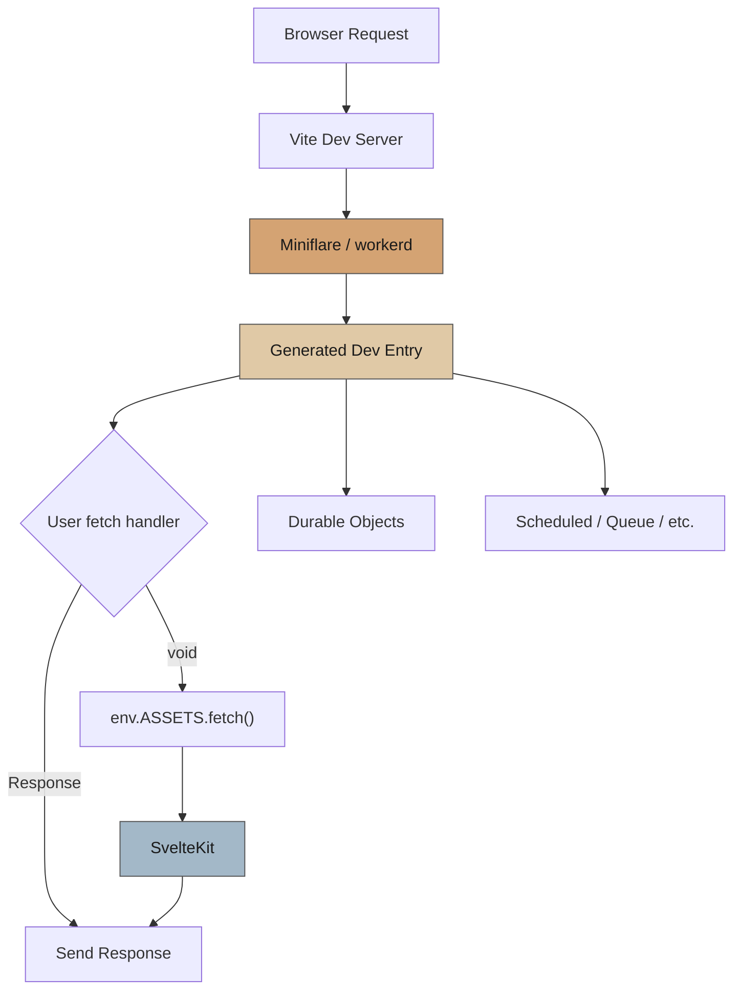
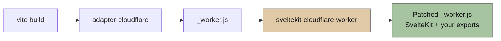

# sveltekit-cloudflare-worker

A Vite plugin that unlocks the full Cloudflare Workers platform from a SvelteKit app.

## Why

`@sveltejs/adapter-cloudflare` generates a single `fetch` handler. You can't export Durable Objects, Workflows, or define `scheduled`/`queue`/`email` handlers.

This plugin lets you write a `src/worker.ts` alongside your SvelteKit app. You export whatever you need, and the plugin wires everything up.

## Setup

### Install

```bash
npm install sveltekit-cloudflare-worker
```

### Configure Vite

```ts
// vite.config.ts
import { sveltekit } from '@sveltejs/kit/vite';
import { cloudflareWorker } from 'sveltekit-cloudflare-worker';
import { defineConfig } from 'vite';

export default defineConfig({
	plugins: [sveltekit(), cloudflareWorker()]
});
```

### Create your worker file

```ts
// src/worker.ts
import type { WorkerFetch, WorkerScheduled } from 'sveltekit-cloudflare-worker';
import { DurableObject } from 'cloudflare:workers';

interface Env {
	MY_DO: DurableObjectNamespace<MyDurableObject>;
	ASSETS: Fetcher;
}

export const fetch: WorkerFetch<Env> = async (req, env, ctx, next) => {
	const url = new URL(req.url);

	if (url.pathname === '/api/do') {
		const stub = env.MY_DO.get(env.MY_DO.idFromName('test'));
		const message = await stub.sayHello();
		return Response.json({ message });
	}

	if (url.pathname.startsWith('/api/')) {
		return new Response('custom API response');
	}

	// Return nothing → request falls through to SvelteKit
	// Or call next() to get SvelteKit's response and transform it
};

export const scheduled: WorkerScheduled = async (controller, env, ctx) => {
	console.log('cron triggered:', controller.cron);
};

export class MyDurableObject extends DurableObject {
	async sayHello(): string {
		return 'Hello from Durable Object!';
	}
}
```

### TypeScript

To resolve `cloudflare:workers` imports and get proper types, use one of these approaches:

**Option A: Generate types from wrangler config (recommended)**

```bash
npx wrangler types
```

This generates `worker-configuration.d.ts` with both the `cloudflare:*` module declarations and a typed `Env` interface matching your wrangler bindings. Add it to your `tsconfig.json`:

```jsonc
{
	"include": ["worker-configuration.d.ts"]
}
```

Re-run `npx wrangler types` whenever you change bindings in `wrangler.jsonc`.

**Option B: Use `@cloudflare/workers-types`**

```jsonc
{
	"compilerOptions": {
		"types": ["@cloudflare/workers-types"]
	}
}
```

### Configure Wrangler

Standard `wrangler.jsonc` — add bindings for DOs, KV, D1, etc. as usual:

```jsonc
{
	"name": "my-app",
	"main": ".svelte-kit/cloudflare/_worker.js",
	"compatibility_date": "2025-01-01",
	"assets": {
		"binding": "ASSETS",
		"directory": ".svelte-kit/cloudflare"
	},
	"durable_objects": {
		"bindings": [{ "name": "MY_DO", "class_name": "MyDurableObject" }]
	},
	"migrations": [{ "tag": "v1", "new_sqlite_classes": ["MyDurableObject"] }]
}
```

### Configure the adapter (optional)

If you use Durable Objects, you may see workerd warnings about DO classes during `vite dev`. To suppress them, pass `proxyConfig()` to the adapter:

```js
// svelte.config.js
import adapter from '@sveltejs/adapter-cloudflare';
import { proxyConfig } from 'sveltekit-cloudflare-worker';

export default {
	kit: {
		adapter: adapter({
			platformProxy: { configPath: await proxyConfig() }
		})
	}
};
```

`proxyConfig()` reads your wrangler config, adds `script_name` to Durable Object bindings to suppress workerd validation warnings, writes the result to a temp file, and returns its path.

## Supported exports

### Handlers

| Export       | Type                    | Description                                                                         |
| ------------ | ----------------------- | ----------------------------------------------------------------------------------- |
| `fetch`      | `WorkerFetch<Env>`      | Runs before SvelteKit. Return `Response`, `void` to fall through, or call `next()`. |
| `scheduled`  | `WorkerScheduled<Env>`  | Cron trigger handler                                                                |
| `queue`      | `WorkerQueue<Env>`      | Queue consumer handler                                                              |
| `email`      | `WorkerEmail<Env>`      | Email routing handler                                                               |
| `tail`       | `WorkerTail<Env>`       | Tail worker handler                                                                 |
| `trace`      | `WorkerTrace<Env>`      | Trace handler                                                                       |
| `tailStream` | `WorkerTailStream<Env>` | Tail stream handler                                                                 |

### Classes

Any exported class is re-exported from the final worker:

- **Durable Objects** (`extends DurableObject`)
- **Workflows** (`extends WorkflowEntrypoint`)
- **Worker Entrypoints** (`extends WorkerEntrypoint`) — named exports only, the default export is managed by the plugin

## Options

```ts
cloudflareWorker({
	workerFile: 'src/worker.ts' // default
});
```

## Examples

### Using Hono

Mount a Hono app for your API routes and let everything else fall through to SvelteKit:

```ts
// src/worker.ts
import type { WorkerFetch } from 'sveltekit-cloudflare-worker';
import { Hono } from 'hono';

interface Env {
	DB: D1Database;
}

const api = new Hono<{ Bindings: Env }>()
	.basePath('/api')
	.get('/users', async (c) => {
		const users = await c.env.DB.prepare('SELECT * FROM users').all();
		return c.json(users.results);
	})
	.post('/users', async (c) => {
		const { name } = await c.req.json();
		await c.env.DB.prepare('INSERT INTO users (name) VALUES (?)').bind(name).run();
		return c.json({ ok: true }, 201);
	});

export const fetch: WorkerFetch<Env> = async (req, env, ctx, next) => {
	const res = await api.fetch(req, env, ctx);
	// Hono returns 404 for unmatched routes — fall through to SvelteKit
	if (res.status === 404) return;
	return res;
};
```

### Transforming SvelteKit responses

Use `next()` to call SvelteKit and modify the response — add headers, transform the body, etc:

```ts
// src/worker.ts
import type { WorkerFetch } from 'sveltekit-cloudflare-worker';

export const fetch: WorkerFetch = async (req, env, ctx, next) => {
	const url = new URL(req.url);

	// Handle API routes directly
	if (url.pathname.startsWith('/api/')) {
		return new Response('handled by worker');
	}

	// For everything else, let SvelteKit handle it but add security headers
	const res = await next();
	const headers = new Headers(res.headers);
	headers.set('X-Frame-Options', 'DENY');
	headers.set('X-Content-Type-Options', 'nosniff');
	headers.set('Referrer-Policy', 'strict-origin-when-cross-origin');
	headers.set('Permissions-Policy', 'camera=(), microphone=(), geolocation=()');
	return new Response(res.body, { status: res.status, headers });
};
```

## How it works

### Dev mode

The plugin wraps `@cloudflare/vite-plugin` to run your worker inside a real `workerd` runtime via Miniflare. It generates a dev entry that re-exports your classes, wraps your `fetch` to fall through to SvelteKit via `env.ASSETS.fetch()`, and re-exports other handlers directly.



### Build mode

At build time, the plugin runs after `@sveltejs/adapter-cloudflare`. It bundles `src/worker.ts` with esbuild and patches the generated `_worker.js` to include your handler exports and class re-exports.



## License

MIT
