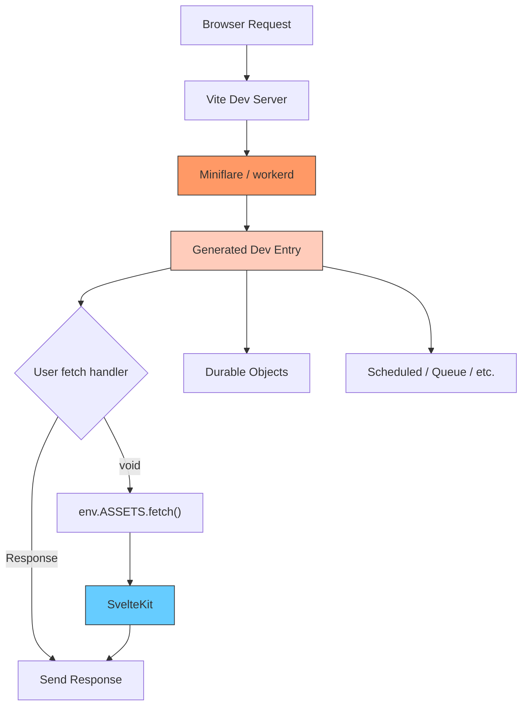
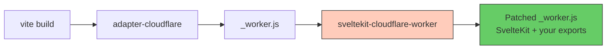

# sveltekit-cloudflare-worker

A Vite plugin that unlocks the full Cloudflare Workers platform from a SvelteKit app.

## Why

`@sveltejs/adapter-cloudflare` generates a single `fetch` handler. You can't export Durable Objects, Workflows, or define `scheduled`/`queue`/`email` handlers.

This plugin lets you write a `src/worker.ts` alongside your SvelteKit app. You export whatever you need, and the plugin wires everything up.

## Setup

### Install

```bash
npm install sveltekit-cloudflare-worker
```

### Configure Vite

```ts
// vite.config.ts
import { sveltekit } from '@sveltejs/kit/vite';
import { cloudflareWorker } from 'sveltekit-cloudflare-worker';
import { defineConfig } from 'vite';

export default defineConfig({
	plugins: [sveltekit(), cloudflareWorker()]
});
```

### Create your worker file

```ts
// src/worker.ts
import type { WorkerFetch, WorkerScheduled } from 'sveltekit-cloudflare-worker';
import { DurableObject } from 'cloudflare:workers';

interface Env {
	MY_DO: DurableObjectNamespace<MyDurableObject>;
	ASSETS: Fetcher;
}

export const fetch: WorkerFetch<Env> = async (req, env, ctx) => {
	const url = new URL(req.url);

	if (url.pathname === '/api/do') {
		const stub = env.MY_DO.get(env.MY_DO.idFromName('test'));
		const message = await stub.sayHello();
		return Response.json({ message });
	}

	if (url.pathname.startsWith('/api/')) {
		return new Response('custom API response');
	}

	// Return nothing → request falls through to SvelteKit
};

export const scheduled: WorkerScheduled = async (controller, env, ctx) => {
	console.log('cron triggered:', controller.cron);
};

export class MyDurableObject extends DurableObject {
	async sayHello(): string {
		return 'Hello from Durable Object!';
	}
}
```

### TypeScript

Add `@cloudflare/workers-types` to your `tsconfig.json` so that `cloudflare:workers` imports resolve:

```jsonc
{
	"compilerOptions": {
		"types": ["@cloudflare/workers-types"]
	}
}
```

### Configure Wrangler

Standard `wrangler.jsonc` — add bindings for DOs, KV, D1, etc. as usual:

```jsonc
{
	"name": "my-app",
	"main": ".svelte-kit/cloudflare/_worker.js",
	"compatibility_date": "2025-01-01",
	"assets": {
		"binding": "ASSETS",
		"directory": ".svelte-kit/cloudflare"
	},
	"durable_objects": {
		"bindings": [{ "name": "MY_DO", "class_name": "MyDurableObject" }]
	},
	"migrations": [{ "tag": "v1", "new_sqlite_classes": ["MyDurableObject"] }]
}
```

## Suppressing dev warnings

During `vite dev`, wrangler may emit warnings about internal Durable Objects not working in local development. These are false positives — the plugin handles DO resolution via `@cloudflare/vite-plugin`'s wrapper module.

To suppress them, add a `script_name` to your DO bindings in `wrangler.jsonc`:

```jsonc
{
	"durable_objects": {
		"bindings": [
			{
				"name": "MY_DO",
				"class_name": "MyDurableObject",
				"script_name": "worker-svelte-kit"
			}
		]
	}
}
```

The value of `script_name` doesn't matter — the plugin strips it before passing the config to the cloudflare vite plugin, so DOs are always treated as local during dev. The field only exists to silence wrangler's config validation.

## Supported exports

### Handlers

| Export      | Type                   | Description                                                         |
| ----------- | ---------------------- | ------------------------------------------------------------------- |
| `fetch`     | `WorkerFetch<Env>`     | Runs before SvelteKit. Return `Response` or `void` to fall through. |
| `scheduled` | `WorkerScheduled<Env>` | Cron trigger handler                                                |
| `queue`     | `WorkerQueue<Env>`     | Queue consumer handler                                              |
| `email`     | `WorkerEmail<Env>`     | Email routing handler                                               |
| `tail`      | `WorkerTail<Env>`      | Tail worker handler                                                 |
| `trace`     | `WorkerTrace<Env>`     | Trace handler                                                       |

### Classes

Any exported class is re-exported from the final worker:

- **Durable Objects** (`extends DurableObject`)
- **Workflows** (`extends WorkflowEntrypoint`)
- **Worker Entrypoints** (`extends WorkerEntrypoint`)

## Options

```ts
cloudflareWorker({
	workerFile: 'src/worker.ts' // default
});
```

## How it works

### Dev mode

The plugin wraps `@cloudflare/vite-plugin` to run your worker inside a real `workerd` runtime via Miniflare. It generates a dev entry that re-exports your classes, wraps your `fetch` to fall through to SvelteKit via `env.ASSETS.fetch()`, and re-exports other handlers directly.



### Build mode

At build time, the plugin runs after `@sveltejs/adapter-cloudflare`. It bundles `src/worker.ts` with esbuild and patches the generated `_worker.js` to include your handler exports and class re-exports.



## License

MIT
